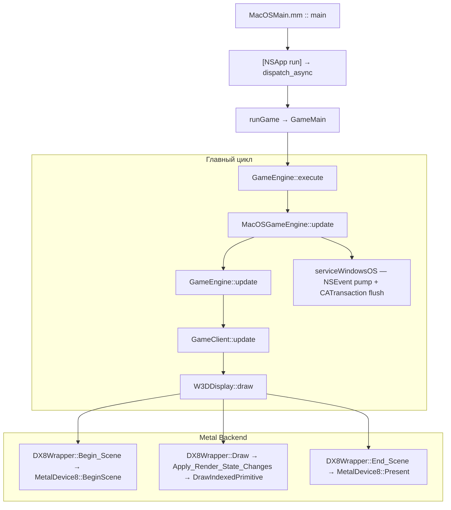

# macOS Port — Конвейер рендеринга (Rendering Pipeline)

> Обновлено: 2026-04-03

---

## Обзор

Движок C&C Generals (Zero Hour) использует DirectX 8 через `DX8Wrapper` (статический класс). 
Наш подход: **Гибрид A+B** — класс `DX8Wrapper` остаётся с тем же API, но Metal-реализация подставляется через `#ifdef __APPLE__` в `dx8wrapper_metal.mm`.

Потребительский код (WW3D2, W3DDevice) вызывает `DX8Wrapper::Draw_Triangles()`, `DX8Wrapper::Set_Transform()` — **ничего менять не нужно**.

---

## Адаптер DX8 → Metal

### Два уровня

| Уровень | Файл | Роль |
|:---|:---|:---|
| **DX8Wrapper** | `dx8wrapper_metal.mm` | Статический класс — кэширует render state, вызывает D3DDevice |
| **MetalDevice8** | `MetalDevice8.mm` | Реализует `IDirect3DDevice8` — работает с Metal напрямую |

### Основные компоненты

| Компонент | Роль |
|:---|:---|
| `MetalInterface8` | `IDirect3D8` — перечисление адаптеров, создание устройства |
| `MetalDevice8` | `IDirect3DDevice8` — MTLDevice, MTLCommandQueue, CAMetalLayer |
| `MetalTexture8` | `IDirect3DTexture8` — обёртка MTLTexture (buffer-backed) |
| `MetalSurface8` | `IDirect3DSurface8` — staging buffer + загрузка в родительскую текстуру |
| `MetalVertexBuffer8` | `IDirect3DVertexBuffer8` — MTLBuffer |
| `MetalIndexBuffer8` | `IDirect3DIndexBuffer8` — MTLBuffer |
| `MacOSShaders.metal` | FFP эмуляция (vertex + fragment) |

---

## Жизненный цикл кадра

### 1. `Clear(count, rects, flags, color, z, stencil)`
- Завершает текущий encoder если есть
- Создает `MTLRenderPassDescriptor`:
  - `D3DCLEAR_TARGET` → `MTLLoadActionClear` + clearColor
  - Без → `MTLLoadActionLoad`
- Depth: `Depth32Float_Stencil8`
- Создает новый `MTLRenderCommandEncoder`
- Устанавливает `MTLViewport` из `m_Viewport`
- **Автоматически вызывает `BeginScene()` если вызван до него** (WW3D вызывает Clear до BeginScene)

### 2. `BeginScene()`
- Проверяет `m_InScene` (поддерживает множественные BeginScene/EndScene за кадр для RTT)
- Создает `MTLCommandBuffer`
- Получает `CAMetalDrawable` от `CAMetalLayer` (`nextDrawable`)

### 3. Draw Calls (`DrawIndexedPrimitive`, `DrawPrimitive`, `DrawPrimitiveUP`)
1. `EnsureCurrentEncoder()` — создаёт encoder если нет (loadAction=Load)
2. `GetBufferFVF(m_StreamSource)` — получает FVF из VB
3. `GetPSO(fvf, stride)` — получает/создаёт Pipeline State Object (кэш)
4. `setRenderPipelineState:pso`
5. `ApplyPerDrawState()` — cull mode (FORCED NONE), depth/stencil, z-bias
6. Привязка VB: `setVertexBuffer:atIndex:0`
7. Привязка zero buffer: `setVertexBuffer:atIndex:30` (для missing FVF attributes)
8. `BindUniforms(fvf)` — buffer(1) MetalUniforms + buffer(2) FragmentUniforms
9. `BindCustomVSUniforms()` — buffer(4) + buffer(5)
10. `BindTexturesAndSamplers()` — текстуры и семплеры для stage 0..3
11. `drawIndexedPrimitives` / `drawPrimitives`

### 4. `Present()`
- `endEncoding` у текущего encoder
- `presentDrawable` + `commit` для command buffer
- `waitUntilCompleted` — синхронизация GPU/CPU
- Сброс drawable, encoder, command buffer
- Инкремент frame counter

---

## Pipeline State Objects (PSO)

`GetPSO(DWORD fvf, UINT stride)` создаёт или извлекает из кэша `m_PsoCache`.

**Ключ PSO** (`uint64_t`): `fvf | blendEnable | srcBlend | dstBlend | cwMask | alphaTestEnable | stride | hasDepth | sampleCount`

### Дескриптор вершин (из FVF)

| Флаг FVF | Атрибут | Формат Metal | Размер |
|:---|:---|:---|:---|
| `D3DFVF_XYZ` | attr[0] position | Float3 | 12B |
| `D3DFVF_XYZRHW` | attr[0] position | Float4 | 16B |
| `D3DFVF_NORMAL` | attr[3] normal | Float3 | 12B |
| `D3DFVF_DIFFUSE` | attr[1] color | UChar4Normalized_BGRA | 4B |
| `D3DFVF_SPECULAR` | attr[4] specular | UChar4Normalized_BGRA | 4B |
| `D3DFVF_TEX1+` | attr[2] texCoord0 | Float2 | 8B |
| `D3DFVF_TEX2` | attr[5] texCoord1 | Float2 | 8B |

> **Порядок полей в памяти:** position → normal → diffuse → specular → texcoords.
> Stride берётся от вызывающего кода, НЕ вычисляется как сумма атрибутов.

### Missing Attribute Defaults (buffer 30)
Неиспользуемые атрибуты подключаются к `m_ZeroBuffer` (MTLVertexStepFunctionConstant):
- Missing diffuse: white (0xFFFFFFFF)
- Missing specular: black (0x00000000)
- Missing position/texCoord/normal: (0,0,0)

### Uniform буферы

| Индекс | Стадия | Структура | Содержимое |
|:---|:---|:---|:---|
| buffer(0) | Vertex | — | Данные вершин (VB) |
| buffer(1) | V+F | `MetalUniforms` | world/view/projection, screenSize, useProjection, texMatrix[4] |
| buffer(2) | Fragment | `FragmentUniforms` | TSS config (4 stages), textureFactor, fog, alphaTest, hasTexture[4] |
| buffer(3) | Vertex | `LightingUniforms` | До 4 lights, materials, fog params |
| buffer(4) | Vertex | `CustomVSUniforms` | shaderType + VS constants c0..c33 |
| buffer(5) | Fragment | `CustomPSUniforms` | psType + PS constants c0..c7 |
| buffer(30) | Vertex | — | Zero buffer для missing attributes |

---

## Шейдеры (`MacOSShaders.metal`)

### Вершинный шейдер (`vertex_main`)

Три пути:

**1. Custom VS: Trees (shaderType == 1)** — `Trees.vso`
- c4-c7: WVP матрица (transposed row-major)
- Sway displacement: swayType из normal.x, weight из pos.z - normal.z
- Shroud UV: c32 (offset) + c33 (scale)

**2. Custom VS: Water Wave (shaderType == 2)** — `wave.vso`
- c2-c5: WVP матрица (transposed)
- UV1: текстурная проекция для отражения (c6-c9)

**3. Standard VS (shaderType == 0)**
- `useProjection == 1`: `pos = projection * view * world * pos` (3D)
- `useProjection == 2`: screen coords → NDC (XYZRHW), Y-flip для Metal
- Per-vertex lighting (DX8 FFP): до 4 lights, ambient/diffuse/specular

**Fog (все пути):** linear, exp, exp2. 2D = без тумана (fogFactor=1.0).

### Фрагментный шейдер (`fragment_main`)

**Путь A: Custom PS (psType != 0)** — terrain blend, road, monochrome, wave bump

**Путь B: TSS Pipeline (psType == 0)** — полный D3DTOP processing для 4 стадий:
- `resolveArg()`: D3DTA_DIFFUSE, CURRENT, TEXTURE, TFACTOR, SPECULAR
- `evaluateOp()`: SELECTARG, MODULATE, ADD, SUBTRACT, BLEND*, DOTPRODUCT3, etc.

**Post-processing:** alpha test → fog → specular add

---

## Конвейер текстур

### Buffer-Backed Textures (несжатые)
1. `CreateTexture` → `MetalTexture8` с `MTLBuffer` (выровненная структура)
2. `LockRect` → прямой указатель на `MTLBuffer.contents + mipOffset`
3. Игра пишет пиксели в GPU-видимую память
4. `UnlockRect` → no-op для single-mip; `replaceRegion` для multi-mip
5. Mipmap generation: асинхронный `generateMipmapsForTexture` через blit encoder

### Compressed Textures (DXT1/3/5)
1. `LockRect` → staging buffer через `malloc`
2. `UnlockRect` → `replaceRegion`, затем `free`

### Format Conversion
Форматы R8G8B8, A4L4 конвертируются в BGRA8/RG8 через `m_ConvertBuf`.

---

## Фильтрация текстур и баг с dx8caps (Shroud / Radar)

В оригинальном `dx8caps.cpp` секция `#ifdef __APPLE__` инициализирует возможности устройства, но **не включает** флаги `D3DPTFILTERCAPS_MINFLINEAR` и `D3DPTFILTERCAPS_MAGFLINEAR`. Из-за этого функция `TextureFilterClass::_Init_Filters()` считает, что линейная фильтрация не поддерживается, и откатывает все запросы на `FILTER_TYPE_BEST` / `FILTER_TYPE_DEFAULT` до обычного `D3DTEXF_POINT`.

Изначальный разработчик Metal-порта оставил комментарий в `MetalDevice8.mm`, указывая на то, что `POINT` фильтрация полезна для кнопок UI (чтобы избежать артефактов "смешивания" блоков (bleeding) на прозрачных границах DXT1 текстур при скейлинге). Однако этот системный фоллбэк также сломал все игровые элементы, которым требовалось плавное отображение (Туман Войны (Shroud), Радар, Вода), сделав их "пиксельными".

### Специфичное для Metal решение

Вместо того, чтобы модифицировать загрузчик в `dx8caps.cpp` (и нарушать политику нулевых изменений для общего кода движка `Core/`), мы перехватываем настройку сэмплера в `MetalDevice8::GetSamplerState()`:
* **UI элементы** (которые должны оставаться четкими в `POINT`) по умолчанию тайлятся и используют режим адресации `TEXTURE_ADDRESS_REPEAT`.
* **Игровые оверлеи и вода** (Shroud, Radar), которые должны быть плавными `LINEAR`, инициализируются с явным выставлением `TEXTURE_ADDRESS_CLAMP`.

Поэтому мы динамически повышаем фильтрацию с `POINT` до `LINEAR`, если *оба* параметра (U и V) используют `D3DTADDRESS_CLAMP`. Это элегантно сглаживает туман/радар/воду, при этом оставляя жесткий пиксельный сэмплинг для UI кнопок. Отрисовка символов в шрифтах (`render2dsentence.cpp`) также использует `CLAMP`, но так как они всегда отрисовываются на экране 1:1, билинейная интерполяция математически возвращает изначальный цвет текселя без размытия.

---

## Два пути 2D-рендеринга

В движке есть **два** разных пути для 2D-контента:

| Путь | FVF | Шейдер | Кто использует |
|:---|:---|:---|:---|
| **Путь A** (`Render2DClass`) | `D3DFVF_XYZ` (0x252) | `useProjection==1` с identity матрицами | Кнопки, текст меню, фон UI |
| **Путь B** (`DrawPrimitiveUP`) | `D3DFVF_XYZRHW` | `useProjection==2` с screen→NDC | Отдельные 2D операции (radar, shroud overlay) |

### Путь A: `Render2DClass` (XYZ + identity)

`Render2DClass` подготавливает вершины уже в NDC-координатах (-1..+1) и устанавливает identity матрицы для world/view/projection. В шейдере: `projection * view * world * pos = I * I * I * pos = pos` — вершины проходят напрямую.

Этот путь **неотличим от 3D** на стороне Metal — тот же PSO, тот же vertex shader path.

### Путь B: `DrawPrimitiveUP` (XYZRHW)

Для `D3DFVF_XYZRHW` вершин (экранные координаты) в `DrawPrimitiveUP` применяются три overrides:

1. **Depth test/write отключены** — 2D UI поверх 3D геометрии
2. **Culling отключен** — Y-flip в шейдере меняет winding CW → CCW
3. **`useProjection == 2`** — шейдер конвертирует screen coords → NDC: `pos / screenSize * 2 - 1`, Y-flip

---

## DX8 Geometry Bias и 2D рендеринг (Half-Pixel Offset)

В DirectX 8/9 существовала особенность архитектуры, требовавшая смещать 2D-координаты геометрии на `-0.5` пикселя для "pixel-perfect" семплирования текселей (так называемый *Half-Pixel Offset*). Для этого движок (w3d) включал флаг `WW3D::Set_Screen_UV_Biased(TRUE)`, что заставляло `Render2DClass` принудительно вычитать `0.5f` из позиций вершин.

В **Metal**, как и во всех современных 3D API, растеризатор математически корректно обрабатывает центры пикселей (`+0.5`), так что целочисленные 2D-координаты не нуждаются в этом сдвиге-хаке.
* **Ошибка:** Если Metal-бэкенд получает смещенную на `-0.5` геометрию, полигоны съезжают ровно так, что оригинальные центры пикселей попадают на *границу* интерполяции текстуры (`Nearest Neighbor`). При округлений Metal может начать перескакивать на соседний тексель, вызывая горизонтальные разрывы (shearing) и деформации однопиксельных линий в UI и шрифтах.
* **Решение:** В macOS сборке мы оборачиваем смещение в `Vector2 bais_add( -0.5f ,-0.5f );` (файл `render2d.cpp`) директивой `#ifndef __APPLE__`. Тем самым интерфейс шлет *точные* целые координаты в Metal, и растеризатор семплирует текстуры математически идеально в центре текселя.

---

## Шрифтовой пайплайн (Font Atlas)

### Архитектура

`FontCharsClass` (`render2dsentence.cpp`) рендерит глифы в bitmap-буфер, затем копирует в текстуру-атлас (формат ARGB4444). Каждый символ хранится как `FontCharsClassCharDataStruct` с шириной и указателем в буфер.

### Windows (GDI)

1. `CreateFont()` — системный шрифт (Arial, bold/normal)
2. `CreateDIBSection()` — **top-down** DIB (biHeight < 0): row 0 = верхняя строка в памяти
3. `ExtTextOutW()` — рендерит глиф в 24-bit RGB DIB
4. Копирование: `row=0` → прямой порядок (top→bottom), шаг `index += 3` (RGB)

### macOS (CoreText)

1. `CTFontCreateWithName()` + `CTFontCreateCopyWithSymbolicTraits(kCTFontBoldTrait)` для bold
2. `CGBitmapContextCreate(NULL, ...)` — 8-bit grayscale. Данные хранятся **top-down** (row 0 = верхняя строка)
3. `CTLineDraw()` — рендерит глиф. `textPosition.y = charDescent` (baseline от низа bitmap)
4. Копирование: `row=0` → прямой порядок (top→bottom), шаг `index += 1` (grayscale)

### ⚠️ CG Bitmap — top-down ориентация

`CGBitmapContextCreate` с `NULL` data создаёт буфер с **top-down** порядком строк: `row 0 = верхняя строка`. Это подтверждено эмпирически (дамп буфера для символа 'R': rows 0-2 = нули над глифом, rows 12-14 = пиксели ножек).

**Не нужна Y-инверсия** при копировании в атлас — строки копируются как есть (`index = row * stride`).

---

## Матрицы: D3D → Metal

D3D хранит матрицы в row-major порядке. `memcpy` в Metal `float4x4` (column-major) эффективно **транспонирует** матрицу. Шейдер использует: `pos_clip = projection * view * world * pos` что эквивалентно D3D `pos * W * V * P`.

### Важно: `DX8Wrapper::render_state` vs `MetalDevice8::m_Transforms`
- `Set_Transform(WORLD/VIEW)` сохраняет в `render_state.world/view` (deferred)
- `Apply_Render_State_Changes()` пушит в `MetalDevice8` через `DX8CALL(SetTransform)`
- `Set_Transform(PROJECTION)` пушит **сразу** через `DX8CALL`
- `Set_World_Identity()` / `Set_View_Identity()` — устанавливают identity в render_state
