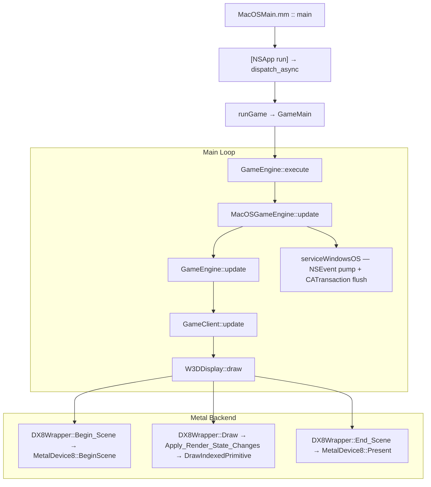

# macOS Port — Rendering Pipeline

> Updated: 2026-04-15

---

## Overview

The C&C Generals (Zero Hour) engine uses DirectX 8 via `DX8Wrapper` (a static class).
The macOS port preserves the same `DX8Wrapper` API, with Metal implementation substituted via `#ifdef __APPLE__` in `dx8wrapper_metal.mm`.

Consumer code (WW3D2, W3DDevice) calls `DX8Wrapper::Draw_Triangles()`, `DX8Wrapper::Set_Transform()` — **no changes needed**.

---

## DX8 → Metal Adapter

### Two Levels

| Level | File | Role |
|:---|:---|:---|
| **DX8Wrapper** | `dx8wrapper_metal.mm` | Static class — caches render state, calls D3DDevice |
| **MetalDevice8** | `MetalDevice8.mm` | Implements `IDirect3DDevice8` — works directly with Metal |

### Components

| Component | Role |
|:---|:---|
| `MetalInterface8` | `IDirect3D8` — adapter enumeration, device creation |
| `MetalDevice8` | `IDirect3DDevice8` — MTLDevice, MTLCommandQueue, CAMetalLayer |
| `MetalTexture8` | `IDirect3DTexture8` — MTLTexture wrapper (buffer-backed) |
| `MetalSurface8` | `IDirect3DSurface8` — staging buffer + upload to parent texture |
| `MetalVertexBuffer8` | `IDirect3DVertexBuffer8` — MTLBuffer |
| `MetalIndexBuffer8` | `IDirect3DIndexBuffer8` — MTLBuffer |
| `MacOSShaders.metal` | FFP emulation (vertex + fragment shaders) |

---

## Frame Lifecycle

### 1. `Clear(count, rects, flags, color, z, stencil)`
- Ends current encoder if present
- Creates `MTLRenderPassDescriptor`:
  - `D3DCLEAR_TARGET` → `MTLLoadActionClear` + clearColor
  - Without → `MTLLoadActionLoad`
- Depth: `Depth32Float_Stencil8`
- Creates new `MTLRenderCommandEncoder`
- Sets `MTLViewport` from `m_Viewport`
- **Automatically calls `BeginScene()` if invoked before it** (WW3D calls Clear before BeginScene)

### 2. `BeginScene()`
- Checks `m_InScene` (supports multiple BeginScene/EndScene per frame for RTT)
- Creates `MTLCommandBuffer`
- Acquires `CAMetalDrawable` from `CAMetalLayer` (`nextDrawable`)

### 3. Draw Calls (`DrawIndexedPrimitive`, `DrawPrimitive`, `DrawPrimitiveUP`)
1. `EnsureCurrentEncoder()` — creates encoder if none (loadAction=Load)
2. `GetBufferFVF(m_StreamSource)` — gets FVF from VB
3. `GetPSO(fvf, stride)` — gets/creates Pipeline State Object (cached)
4. `setRenderPipelineState:pso`
5. `ApplyPerDrawState()` — cull mode (FORCED NONE for 2D), depth/stencil, z-bias
6. VB binding: `setVertexBuffer:atIndex:0`
7. Zero buffer binding: `setVertexBuffer:atIndex:30` (for missing FVF attributes)
8. `BindUniforms(fvf)` — buffer(1) MetalUniforms + buffer(2) FragmentUniforms
9. `BindCustomVSUniforms()` — buffer(4) + buffer(5)
10. `BindTexturesAndSamplers()` — textures and samplers for stage 0..3
11. `drawIndexedPrimitives` / `drawPrimitives`

### 4. `Present()`
- `endEncoding` on current encoder
- `presentDrawable` + `commit` for command buffer
- `waitUntilCompleted` — GPU/CPU sync
- Reset drawable, encoder, command buffer
- Increment frame counter

---

## Pipeline State Objects (PSO)

`GetPSO(DWORD fvf, UINT stride)` creates or retrieves from `m_PsoCache`.

**PSO key** (`uint64_t`): `fvf | blendEnable | srcBlend | dstBlend | cwMask | alphaTestEnable | stride | hasDepth | sampleCount`

### Vertex Descriptor (from FVF)

| FVF Flag | Attribute | Metal Format | Size |
|:---|:---|:---|:---|
| `D3DFVF_XYZ` | attr[0] position | Float3 | 12B |
| `D3DFVF_XYZRHW` | attr[0] position | Float4 | 16B |
| `D3DFVF_NORMAL` | attr[3] normal | Float3 | 12B |
| `D3DFVF_DIFFUSE` | attr[1] color | UChar4Normalized_BGRA | 4B |
| `D3DFVF_SPECULAR` | attr[4] specular | UChar4Normalized_BGRA | 4B |
| `D3DFVF_TEX1+` | attr[2] texCoord0 | Float2 | 8B |
| `D3DFVF_TEX2` | attr[5] texCoord1 | Float2 | 8B |

> **Memory layout order:** position → normal → diffuse → specular → texcoords.
> Stride is taken from the calling code, NOT computed as the sum of attributes.

### Missing Attribute Defaults (buffer 30)
Unused attributes are connected to `m_ZeroBuffer` (`MTLVertexStepFunctionConstant`):
- Missing diffuse: white (`0xFFFFFFFF`)
- Missing specular: black (`0x00000000`)
- Missing position/texCoord/normal: `(0,0,0)`

### Uniform Buffers

| Index | Stage | Struct | Content |
|:---|:---|:---|:---|
| buffer(0) | Vertex | — | Vertex data (VB) |
| buffer(1) | V+F | `MetalUniforms` | world/view/projection, screenSize, useProjection, texMatrix[4] |
| buffer(2) | Fragment | `FragmentUniforms` | TSS config (4 stages), textureFactor, fog, alphaTest, hasTexture[4] |
| buffer(3) | Vertex | `LightingUniforms` | Up to 4 lights, materials, fog params |
| buffer(4) | Vertex | `CustomVSUniforms` | shaderType + VS constants c0..c33 |
| buffer(5) | Fragment | `CustomPSUniforms` | psType + PS constants c0..c7 |
| buffer(30) | Vertex | — | Zero buffer for missing attributes |

---

## Shaders (`MacOSShaders.metal`)

### Vertex Shader (`vertex_main`)

Three paths:

**1. Custom VS: Trees (shaderType == 1)** — `Trees.vso`
- c4-c7: WVP matrix (transposed row-major)
- Sway displacement: swayType from normal.x, weight from pos.z - normal.z
- Shroud UV: c32 (offset) + c33 (scale)

**2. Custom VS: Water Wave (shaderType == 2)** — `wave.vso`
- c2-c5: WVP matrix (transposed)
- UV1: texture projection for reflection (c6-c9)

**3. Standard VS (shaderType == 0)**
- `useProjection == 1`: `pos = projection * view * world * pos` (3D)
- `useProjection == 2`: screen coords → NDC (XYZRHW), Y-flip for Metal
- Per-vertex lighting (DX8 FFP): up to 4 lights, ambient/diffuse/specular

**Fog (all paths):** linear, exp, exp2. 2D vertices = no fog (fogFactor=1.0).

### Fragment Shader (`fragment_main`)

**Path A: Custom PS (psType != 0)** — terrain blend, road, monochrome, wave bump

| psType | Name | Description |
|:---|:---|:---|
| 1 | `PS_TERRAIN` | `lrp r0, v0.a, t0, t1` — blend by vertex alpha |
| 2-3 | `PS_TERRAIN_NOISE` | terrain + cloud texture (stages 2-3) |
| 4 | `PS_ROAD_NOISE2` | road: t0 * t1 * t2, alpha = t0.a |
| 5 | `PS_MONOCHROME` | luminance = dot(t0.rgb, c0.rgb) * c1 * c2 |
| 6 | `PS_WAVE` | bump water: t1 * c0 (reflection factor) |
| 7-10 | `PS_FLAT_TERRAIN*` | simplified terrain blend variants |

**Path B: TSS Pipeline (psType == 0)** — full D3DTOP processing for 4 stages:
- `resolveArg()`: D3DTA_DIFFUSE, CURRENT, TEXTURE, TFACTOR, SPECULAR
- `evaluateOp()`: SELECTARG, MODULATE, ADD, SUBTRACT, BLEND*, DOTPRODUCT3, etc.

**Post-processing:** alpha test → fog → specular add

---

## Texture Pipeline

### Buffer-Backed Textures (uncompressed)
1. `CreateTexture` → `MetalTexture8` with `MTLBuffer` (aligned layout)
2. `LockRect` → direct pointer to `MTLBuffer.contents + mipOffset`
3. Game writes pixels into GPU-visible memory
4. `UnlockRect` → no-op for single-mip; `replaceRegion` for multi-mip
5. Mipmap generation: async `generateMipmapsForTexture` via blit encoder

### Compressed Textures (DXT1/3/5)
1. `LockRect` → staging buffer via `malloc`
2. `UnlockRect` → `replaceRegion`, then `free`

### Format Conversion
Formats R8G8B8, A4L4 are converted to BGRA8/RG8 via `m_ConvertBuf`.

### 16-bit ↔ 32-bit Conversion
On macOS, 16-bit formats (A1R5G5B5, R5G6B5) are stored as 32-bit BGRA8Unorm internally. `Convert16to32()` expands on lock, `Convert32to16()` compresses on unlock. This enables CPU-side texture recoloring (house colors) to work correctly — the recoloring algorithm reads/modifies 16-bit pixel data, which must round-trip through the 32-bit Metal texture.

### Surface Caching
`MetalTexture8::GetSurfaceLevel` returns a **cached** surface per mip level (not a new allocation each call). This prevents the radar/shroud per-cell update pattern (7500+ calls) from overwriting data with zeroed staging buffers.

---

## Texture Filtering and dx8caps

The original `dx8caps.cpp` `#ifdef __APPLE__` block did not set `D3DPTFILTERCAPS_MINFLINEAR` / `D3DPTFILTERCAPS_MAGFLINEAR`. This caused `TextureFilterClass::_Init_Filters()` to fall back all requests to `D3DTEXF_POINT`.

### Metal-Specific Solution

Instead of modifying `dx8caps.cpp` (which would violate the zero-modification policy for shared `Core/` code), the sampler setup in `MetalDevice8::GetSamplerState()` applies a heuristic:

- **UI elements** (buttons, icons) use `TEXTURE_ADDRESS_REPEAT` → keep POINT filtering (sharp, no DXT1 block artifacts)
- **Game overlays** (shroud, radar, water) use `TEXTURE_ADDRESS_CLAMP` → promote to LINEAR filtering

The rule: if **both** U and V address modes are `D3DTADDRESS_CLAMP`, filtering is promoted from POINT to LINEAR. Font rendering also uses CLAMP but renders at 1:1 scale, so bilinear interpolation produces identical results.

---

## MSAA (Multi-Sample Anti-Aliasing)

Controlled by the `GENERALS_MSAA` environment variable (default: 1 = off, valid: 1, 2, 4).

When enabled:
- `CAMetalLayer` creates MSAA-capable drawables
- Render pass uses `MTLStoreActionStoreAndMultisampleResolve` to preserve destination alpha through resolve
- Depth texture is created with matching `sampleCount`
- PSO key includes `sampleCount` for correct pipeline creation

The resolve action is critical: standard `MultisampleResolve` discards the MSAA texture after resolve, which loses the alpha channel needed for soft water edges. `StoreAndMultisampleResolve` preserves both.

---

## Water Rendering

### Z-Fighting Fix
Water surfaces and terrain beds occupy nearly the same Z depth, causing horizontal banding artifacts ("z-fighting"). A strategic `+1.0f` Z-offset is applied to water vertices in `W3DWater.cpp` (under `#ifdef __APPLE__`), pushing the water plane slightly above the terrain bed.

### Destination Alpha
Soft water edges rely on the destination alpha channel in the framebuffer. The water pixel shader writes alpha based on shore proximity, and subsequent terrain passes read this alpha for edge blending. The MSAA `StoreAndMultisampleResolve` action ensures this alpha survives the resolve step.

---

## Two 2D Rendering Paths

The engine has **two** different paths for 2D content:

| Path | FVF | Shader | Used by |
|:---|:---|:---|:---|
| **Path A** (`Render2DClass`) | `D3DFVF_XYZ` (0x252) | `useProjection==1` with identity matrices | Buttons, menu text, UI backgrounds |
| **Path B** (`DrawPrimitiveUP`) | `D3DFVF_XYZRHW` | `useProjection==2` with screen→NDC | Radar, shroud overlay |

### Path A: `Render2DClass` (XYZ + identity)

`Render2DClass` prepares vertices in NDC coordinates (-1..+1) and sets identity matrices for world/view/projection. In the shader: `projection * view * world * pos = I * I * I * pos = pos` — vertices pass through directly.

### Path B: `DrawPrimitiveUP` (XYZRHW)

For `D3DFVF_XYZRHW` vertices (screen coordinates), three overrides are applied:
1. **Depth test/write disabled** — 2D UI renders on top of 3D geometry
2. **Culling disabled** — Y-flip in shader changes winding CW → CCW
3. **`useProjection == 2`** — shader converts screen coords → NDC: `pos / screenSize * 2 - 1`, Y-flip

---

## Font Pipeline (Font Atlas)

### Architecture

`FontCharsClass` (`render2dsentence.cpp`) renders glyphs into a bitmap buffer, then copies into a texture atlas (format ARGB4444).

### Windows (GDI)
1. `CreateFont()` — system font (Arial, bold/normal)
2. `CreateDIBSection()` — **top-down** DIB (biHeight < 0)
3. `ExtTextOutW()` — renders glyph into 24-bit RGB DIB
4. Copy: row=0 → top-to-bottom order, step `index += 3` (RGB)

### macOS (CoreText)
1. `CTFontCreateWithName()` + bold trait
2. `CGBitmapContextCreate(NULL, ...)` — 8-bit grayscale, **top-down** layout
3. `CTLineDraw()` — renders glyph, `textPosition.y = charDescent` (baseline from bitmap bottom)
4. Copy: row=0 → top-to-bottom order, step `index += 1` (grayscale)

No Y-inversion is needed when copying to the atlas — rows are stored top-down in both platforms.

---

## Matrices: D3D → Metal

D3D stores matrices in row-major order. `memcpy` into Metal `float4x4` (column-major) effectively **transposes** the matrix. The shader uses: `pos_clip = projection * view * world * pos`, equivalent to D3D's `pos * W * V * P`.

### `DX8Wrapper::render_state` vs `MetalDevice8::m_Transforms`
- `Set_Transform(WORLD/VIEW)` saves to `render_state.world/view` (deferred)
- `Apply_Render_State_Changes()` pushes to `MetalDevice8` via `DX8CALL(SetTransform)`
- `Set_Transform(PROJECTION)` pushes **immediately** via `DX8CALL`
- `Set_World_Identity()` / `Set_View_Identity()` — set identity in render_state
